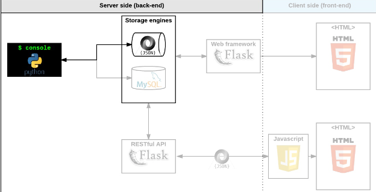
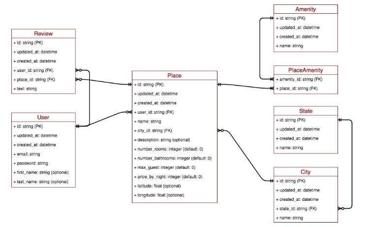

# AirBnB clone project

This is the first step towards building our first full web application: the AirBnB clone. This first step is very important because we will use what you build during this project with all other following projects: HTML/CSS templating, database storage, API, front-end integration…

## Console 
With the console we will :
- create your data model
- manage (create, update, destroy, etc) objects via a console / command interpreter
- store and persist objects to a file (JSON file)

The first piece is to manipulate a powerful storage system. This storage engine will give us an abstraction between “My object” and “How they are stored and persisted”. This means: from your console code (the command interpreter itself) and from the front-end and RestAPI you will build later, you won’t have to pay attention (take care) of how your objects are stored.

This abstraction will also allow you to change the type of storage easily without updating all of your codebase.

The console will be a tool to validate this storage engine



## Synopsis 
The console can `create`, `destroy`, `show`, `update` objects.
```bash
(hbnb) help

Documented commands (type help <topic>):
========================================
EOF  all  create  destroy  help  quit  show update

(hbnb)
```
## Data diagram




## AUTHORS

- [@PrinceKan](https://www.github.com/PrinceKan)
- [@SafieDeme9](https://www.github.com/SafieDeme9)
